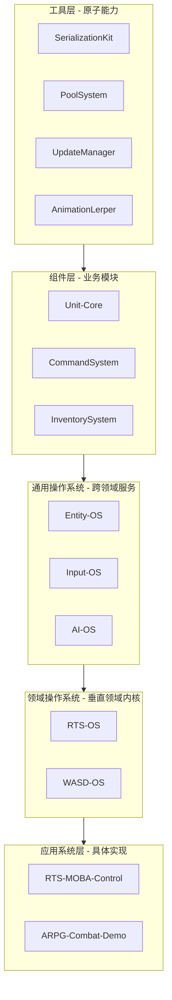

# 总架构图 (The Architecture)

本技术宇宙采用严格的分层架构，下层是上层的基石，上层是下层的价值体现。依赖关系单向流动，确保系统的稳定与可维护性。

## 系统架构概览

**架构解读**：
- **工具层** 提供不可再分的原子能力，是所有创造的原材料。
- **组件层** 将原子能力组合成可复用的业务功能模块。
- **通用OS** 提供任何游戏类型都可能需要的底层服务。
- **领域OS** 整合通用OS与组件，封装特定游戏类型的全部复杂性，提供“开箱即用”的完整解决方案。
- **应用系统层** 基于领域OS，快速构建出具体的、可交付的玩法体验。

## 核心设计理念

### 1. 单向依赖原则
依赖关系永远向下，禁止循环依赖。下层对上层无感知，确保核心稳定性。

### 2. 接口契约原则
层与层之间通过明确定义的接口通信。接口即法律，任何变更都需要严格的架构评审。

### 3. 封装与复用演进
- **工具层**：解决“怎么做” - 封装技术复杂性。
- **组件层**：解决“做什么” - 封装业务逻辑。
- **操作系统层**：解决“在哪用” - 封装领域复杂性，实现最高级别的复用。

## 技术实现规范

### 数据流
1. **配置数据** 通过 `ConfigEditor`（工具层）生成。
2. 由 `SerializationKit`（工具层）统一序列化。
3. 运行时由 **组件层** 和 **操作系统层** 的模块消费。
4. 状态变更通过事件系统通知，遵循观察者模式。

### 生命周期管理
- **工具层**：在应用程序启动时初始化，常驻内存。
- **组件层**：在游戏场景加载时注册和实例化。
- **操作系统层**：按需懒加载，动态提供服务。
- **应用系统层**：由玩家交互或游戏流程触发激活。

---
*架构的终极目标不是约束，而是为无限的创造力提供一个坚实、可预测的舞台。*