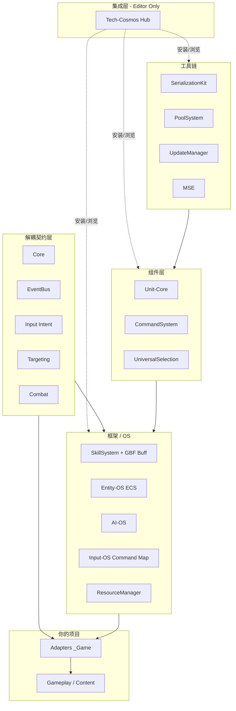

# 总架构图 (The Architecture)

本技术宇宙采用严格的分层架构。各 **Framework 卫星包互不 asmdef 引用**；跨包协作只在 **项目 Adapter 层** 完成。`Tech-Cosmos Hub` 负责浏览、安装与脚手架，不参与运行时逻辑。

## 系统架构概览


```mermaid
graph TB
    subgraph HubLayer [集成层 - Editor Only]
        H[Tech-Cosmos Hub]
    end

    subgraph Contract [解耦契约层]
        C1[Core]
        C2[EventBus]
        C3[Input Intent]
        C4[Targeting]
        C5[Combat]
    end

    subgraph Tools [工具链]
        T1[SerializationKit]
        T2[PoolSystem]
        T3[UpdateManager]
        T4[MSE]
    end

    subgraph Components [组件层]
        B1[Unit-Core]
        B2[CommandSystem]
        B3[UniversalSelection]
    end

    subgraph Framework [框架 / OS]
        F1[SkillSystem + GBF Buff]
        F2[Entity-OS ECS]
        F3[AI-OS]
        F4[Input-OS Command Map]
        F5[ResourceManager]
    end

    subgraph Game [你的项目]
        A[Adapters _Game]
        G[Gameplay / Content]
    end

    H -.->|安装/浏览| Tools
    H -.->|安装/浏览| Components
    H -.->|安装/浏览| Framework
    Contract --> Framework
    Tools --> Components
    Components --> Framework
    Contract --> A
    Framework --> A
    A --> G
```

**架构解读**：

- **Hub 层**：编辑器工具，管理 manifest、README 浏览、胶水生成、目录脚手架。
- **解耦契约层**：`Float3`、`EntityHandle`、事件、输入意图、选目标、伤害请求等**无业务**原语；各包零互引。
- **工具链**：不可再分的原子能力（序列化、对象池、日志、编辑器工具）。
- **组件层**：可复用业务模块（单位核心、命令系统、选择框架）。
- **框架/OS 层**：技能、ECS、AI、资源等领域内核。
- **Adapter 层**：项目中**唯一**同时认识多方的代码；可手写或由 Hub 条件生成。

## 核心设计理念

### 1. 零耦合原则
Framework 包之间 **禁止** 互相 `asmdef references`。需要协作时，通过 Core 契约类型 + 项目 Adapter 传递。

### 2. 单向依赖原则
运行时依赖从上层流向 Adapter 与契约，禁止循环依赖。

### 3. 接口契约原则
层与层之间通过明确定义的类型通信（如 `InputIntent`、`TargetRequest`、`DamageRequest`）。

### 4. Hub 不污染运行时
Hub 程序集仅 Editor，不引用 SkillSystem / ECS 等卫星包，保持安装器纯净。

## 典型数据流（战斗技能栈）

```
玩家输入 → InputIntent (Framework.Input)
         → TargetRequest / TargetResult (Targeting)
         → SkillSystem 施法
         → DamageRequest (Combat)
         → UnitCore / ECS 实体响应
```

上述链路在 **`_Game/Adapters/`** 中接线，而非在框架包内部互相引用。

## 生命周期

| 层级 | 生命周期 |
|------|----------|
| Hub | 编辑器会话；修改 manifest / 生成胶水 |
| 工具链 | 应用启动时初始化，常驻 |
| 组件/框架 | 场景加载时注册，按需激活 |
| Adapter | 组合根启动时装配依赖 |

---

*架构的终极目标不是约束，而是为无限的创造力提供一个坚实、可预测的舞台。*
