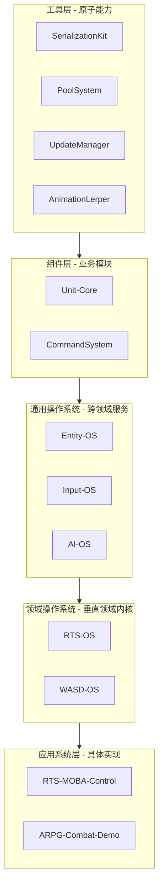

# Tech-Cosmos
A technological cosmos for industrializing game content creation. 游戏内容工业化生产的技术宇宙。

# 🪐 技术宇宙 (The Technological Cosmos)

**这里不是项目的集合，而是体系的呈现。**

我通过构建系统来构建游戏。本仓库是这一思想的指挥中心，它展示了为实现 **"游戏内容工业化生产"** 而搭建的、连贯且自洽的技术体系。

> "我们无法突破维度的边界，但可以在已知的疆土上，建造最辉煌的城池。"

## 🚀 即刻探索

*   **🎯 我们的哲学** → 阅读 [构建者宣言](./MANIFESTO.md)
*   **🏛️ 我们的架构** → 俯瞰 [总架构图](./ARCHITECTURE.md)  
*   **🌌 我们的模块** → 浏览 [技术星图](./GALAXY.md)，直达每一个核心仓库
*   **🧭 新手引导** → 遵循 [快速启动](./GETTING-STARTED.md)
*   **🔭 未来规划** → 查看 [发展路线图](./ROADMAP.md)

## 💡 核心洞察

真正的创造，源于对底层规则的深刻理解与运用。这里的每一个工具、每一个组件，都不是为了解决单一问题，而是为了**消灭某一类问题的存在**。

## 🏗️ 架构全景

## 📚 快速一览

| 层级 | 代表模块 | 核心价值 |
| :--- | :--- | :--- |
| **工具链** | `PoolSystem`, `AnimationLerper` | 提供原子能力，消除重复劳动 |
| **组件层** | `Unit-Core`, `CommandSystem` | 封装业务逻辑，实现高度复用 |
| **操作系统** | `RTS-OS`, `WASD-OS` | 封装领域复杂性，提供开箱即用的解决方案 |
| **应用系统** | `RTS-MOBA-Control-System` | 基于下层模块构建的旗舰级玩法验证 |

## 🛠️ 技术栈

- **引擎**: Unity
- **语言**: C#
- **架构**: 分层设计 + 模块化 + 数据驱动
- **理念**: 配置优于编码，系统优于功能

