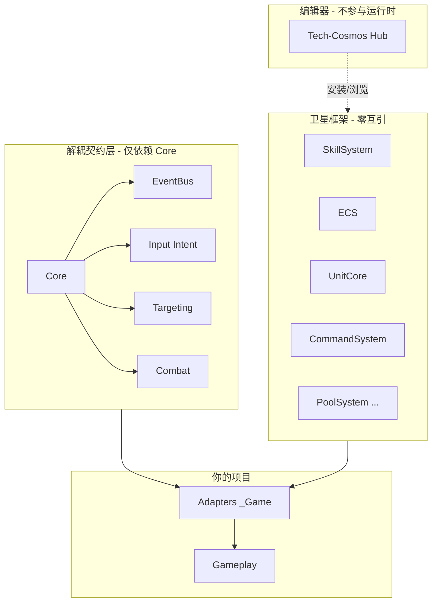
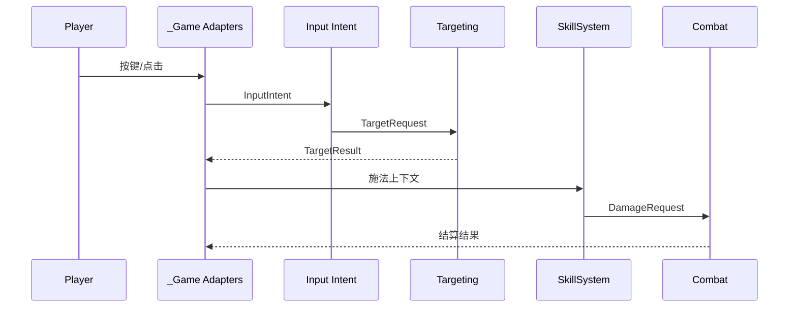

# Tech-Cosmos

**A technological cosmos for industrializing game content creation.**  
游戏内容工业化生产的技术宇宙。

> 这里不是「一堆 Unity 插件」，而是一套可拼装、可演进、可交付的生产体系。  
> 本仓库是**指挥中心**：哲学、架构、星图文档，以及可直接安装的 **[Tech-Cosmos Hub](./Tech-Cosmos.Hub/)** 集成工具。

---

## 目录

- [这是什么](#这是什么)
- [适合谁](#适合谁)
- [5 分钟上手](#5-分钟上手)
- [本仓库包含什么](#本仓库包含什么)
- [核心架构原则](#核心架构原则)
- [依赖关系说明](#依赖关系说明)
- [Tech-Cosmos Hub 完整指南](#tech-cosmos-hub-完整指南)
- [推荐项目目录](#推荐项目目录)
- [全部模块索引](#全部模块索引)
- [典型集成场景](#典型集成场景)
- [战斗技能栈：从输入到伤害](#战斗技能栈从输入到伤害)
- [胶水 Recipe 生成顺序](#胶水-recipe-生成顺序)
- [manifest 配置参考](#manifest-配置参考)
- [两种工作流对比](#两种工作流对比)
- [常见问题 FAQ](#常见问题-faq)
- [文档导航](#文档导航)
- [参与与许可](#参与与许可)

---

## 这是什么

Tech-Cosmos 是一套围绕 **Unity 2022.3 LTS+** 构建的模块化框架生态，目标是把重复劳动下沉到工具与框架，把创造力留给玩法与内容。

| 概念 | 含义 |
|------|------|
| **本仓库 (Tech-Cosmos)** | 导航中枢 + 文档 + Hub 安装包，**不含**全部运行时源码 |
| **卫星仓库** | 每个 UPM 包独立 Git 仓库（SkillSystem、ECS、PoolSystem…） |
| **Hub** | Unity 编辑器窗口：浏览、安装、胶水生成、项目脚手架 |
| **Adapter 层** | 你项目里 `Assets/_Game/Adapters/`，**唯一**跨包集成的代码所在 |

**设计底线（务必理解）：**

1. **卫星框架 Runtime 之间不互相 `asmdef` 引用**（SkillSystem 不引用 Combat，Combat 不引用 SkillSystem）。
2. **契约层**（Core / EventBus / Input / Targeting / Combat）只依赖 **Core**，彼此不互引。
3. **跨包协作**只在项目的 **Adapter** 中完成（可手写，也可由 Hub 条件生成）。
4. **Hub 是纯 Editor 包**，不引用任何卫星框架 asmdef。

---

## 适合谁

| 你是谁 | 建议路径 |
|--------|----------|
| **技术总监 / 架构师** | [MANIFESTO](./MANIFESTO.md) → [ARCHITECTURE](./ARCHITECTURE.md) → [GALAXY](./GALAXY.md) |
| **Unity 开发者** | 安装 Hub → 按需导入包 → 读各包 README → 写 Adapter |
| **招聘 / 评审者** | 本 README + SkillSystem / UnitCore / ECS 独立仓库代码 |
| **想快速出原型的人** | Hub「项目结构」页一键生成 `_Game` + 导入 PoolSystem + UnitCore |

---

## 5 分钟上手

### 步骤 1：安装 Hub

Unity → **Package Manager** → **+** → **Add package from git URL**：

```
https://github.com/PeterParkers007/Tech-Cosmos.git?path=/Tech-Cosmos.Hub
```

### 步骤 2：打开 Hub

菜单：**Tech-Cosmos → Hub**

### 步骤 3：生成项目骨架（可选但推荐）

切到 **项目结构** 页 → 选 **标准** → **一键生成**  
默认创建 `Assets/_Game/`（Scripts、Adapters、Resources、Generated 等）。

### 步骤 4：按需导入框架

切到 **技术框架** 页 → 选中包 → **导入**  
- 本地有 `Assets/Framework/<包名>` 时写入 `file:` 路径  
- 否则写入 catalog 中的 **Git URL**

### 步骤 5：集成

在 `Assets/_Game/Adapters/` 手写胶水，或使用 Hub **胶水生成** 页（见下文）。

---

## 本仓库包含什么

```
Tech-Cosmos/                    ← 你正在看的仓库
├── README.md                   ← 本文件（总入口）
├── MANIFESTO.md                ← 构建者哲学
├── ARCHITECTURE.md             ← 分层架构与数据流
├── GALAXY.md                   ← 全部卫星包链接与说明
├── GETTING-STARTED.md          ← 分角色上手指南
├── ROADMAP.md                  ← 路线图
├── TIMELINE.md                 ← 演进时间线
├── LINKS.md                    ← 联系与社区
├── CONTRIBUTING.md             ← 贡献指南
├── LICENSE                     ← MIT
└── Tech-Cosmos.Hub/            ← UPM 包（可单独 Git 安装）
    ├── package.json
    ├── Editor/                 ← Hub 窗口与服务
    └── Data/                   ← catalog、胶水 Recipe、结构预设
```

**不包含：** SkillSystem / ECS 等卫星包的完整源码（它们在各自 GitHub 仓库）。

---

## 核心架构原则


```mermaid
graph TB
    subgraph Editor [编辑器 - 不参与运行时]
        H[Tech-Cosmos Hub]
    end

    subgraph Contract [解耦契约层 - 仅依赖 Core]
        C0[Core]
        C1[EventBus]
        C2[Input Intent]
        C3[Targeting]
        C4[Combat]
    end

    subgraph Satellites [卫星框架 - 零互引]
        S1[SkillSystem]
        S2[ECS]
        S3[UnitCore]
        S4[CommandSystem]
        S5[PoolSystem ...]
    end

    subgraph Project [你的项目]
        A[Adapters _Game]
        G[Gameplay]
    end

    H -.->|安装/浏览| Satellites
    C0 --> C1 & C2 & C3 & C4
    Contract --> A
    Satellites --> A
    A --> G
```

| 原则 | 实践 |
|------|------|
| **零耦合** | 不在 SkillSystem 里 `using` CombatSystem |
| **契约传递** | 用 `Float3`、`EntityHandle`、`InputIntent`、`DamageRequest` 等类型跨层传数据 |
| **Adapter 集成** | `CastFlowAdapter` 把 Input → Target → Skill 接起来 |
| **Hub 不污染运行时** | Hub 只改 manifest、生成样板，不进 Build |

更细说明见 [ARCHITECTURE.md](./ARCHITECTURE.md)。

---

## 依赖关系说明

> **常见误解**：「所有框架都没有任何依赖。」  
> **准确说法**：卫星框架**彼此之间**几乎不依赖；但仍依赖 **Unity 引擎**，少数包依赖 **Unity 官方模块**，契约层统一依赖 **Core**。

### 卫星包之间

| 关系 | 是否允许 |
|------|----------|
| SkillSystem → CombatSystem | ❌ |
| ECS → UnitCore | ❌ |
| Input → Targeting（契约层） | ❌ 互不引用，只共用 Core 类型 |
| Editor → 本包 Runtime | ✅ 正常 |

### 契约层 → Core

| 包 | asmdef 引用 |
|----|-------------|
| EventBus | `TechCosmos.Core.Runtime` |
| InputSystem (Intent) | `TechCosmos.Core.Runtime` |
| TargetingSystem | `TechCosmos.Core.Runtime` |
| CombatSystem | `TechCosmos.Core.Runtime` |
| **Core** | 无（最底层契约） |

### 外部 Unity 依赖（安装时注意）

| 包 | package.json 依赖 |
|----|-------------------|
| ResourceManager | `com.unity.addressables` |
| UnitCore | `com.unity.ugui` |
| Animation (UI) | `Unity.TextMeshPro`（asmdef） |
| 其余大多数包 | 仅 Unity 内置模块 |

### 内容形态

| 类型 | 说明 |
|------|------|
| **主体** | C# 源码 + asmdef + 文档（代码型 UPM 包） |
| **少量资源** | Hub 的 USS、SkillSystem Samples、Animation 示例场景等 |
| **不是** | 带完整美术/关卡的商业游戏资源包 |

---

## Tech-Cosmos Hub 完整指南

详细文档：[Tech-Cosmos.Hub/README.md](./Tech-Cosmos.Hub/README.md)

### 安装方式

| 方式 | manifest 写法 | 适用 |
|------|---------------|------|
| **Git 子路径（推荐）** | `"com.techcosmos.hub": "https://github.com/PeterParkers007/Tech-Cosmos.git?path=/Tech-Cosmos.Hub"` | 任意 Unity 项目 |
| **本地 file** | `"com.techcosmos.hub": "file:../Assets/Framework/Tech-Cosmos.Hub"` | monorepo 全量嵌入 |

### 三个 Tab

#### 1. 技术框架

| 功能 | 说明 |
|------|------|
| 分类浏览 | Foundation / Framework / Component / Runtime / … |
| README 预览 | 自动读取包目录下 `README.md` |
| 状态徽章 | **已导入 UPM** / **本地可用** / **未导入** |
| 导入 | 本地优先 `file:`，否则 Git URL |
| 移除 | 从 `Packages/manifest.json` 删除依赖 |
| 搜索 | 按名称、分类、描述过滤 |

#### 2. 胶水生成

输出目录：`Assets/_Game/Generated/Hub/*.g.cs`

| Recipe | 作用 | 前置包 |
|--------|------|--------|
| IntegrationEvents | 项目层 EventBus 事件 struct | Core + EventBus |
| GameEntityRegistry | EntityHandle ↔ 场景实体 | Core + Combat |
| GameCompositionRoot | 组合根单例 | Core + Input + Targeting + Combat + EventBus |
| CastFlowAdapter | 施法流 Input→Target→Skill | 上列 + SkillSystem |
| GameEntityBridge | MonoBehaviour 桥接组件 | Core + Combat + SkillSystem |
| ControllerInputSource | 键盘 → InputIntent | Core + Input |

**Hero 类型**：Glue 页可配置 `IntegrationHero` 与命名空间，须与项目 Unit 类型一致。

**重要**：若已在 `Adapters/` 手写同名类，**不要**再生成，会类名冲突。

#### 3. 项目结构

| 预设 | 内容 |
|------|------|
| **精简** | Adapters / Scripts / Resources / Scenes / Generated |
| **标准（推荐）** | 完整 `_Game` 分类目录 |
| **完整** | 标准 + Network / Tests + StreamingAssets |

选项：`.gitkeep`、目录 README、`asmdef` 样板。  
**只创建缺失目录，不删除、不覆盖已有文件。**

在 Hub 面板 **「项目结构」** 标签页中选择预设并生成。

---

## 推荐项目目录

```
YourUnityProject/
├── Packages/
│   └── manifest.json              ← Hub 写入 Git / file 依赖
├── Assets/
│   ├── Framework/                 ← 可选：本地嵌入全部 UPM 包（只读）
│   └── _Game/                     ← 你的游戏（可写）
│       ├── Adapters/              ← ★ 跨包集成唯一入口（手写或 Generated）
│       ├── Scripts/
│       │   ├── Gameplay/
│       │   ├── UI/
│       │   └── ...
│       ├── Resources/
│       ├── Scenes/
│       ├── Prefabs/
│       ├── Art/                   ← 美术（不进 Framework）
│       └── Generated/
│           └── Hub/               ← Hub 生成的 *.g.cs
└── ProjectSettings/
```

**铁律：** `Assets/Framework/` = 框架源码（勿写业务）；`Assets/_Game/` = 你的游戏。

---

## 全部模块索引

> 完整说明与链接见 [GALAXY.md](./GALAXY.md)。下表便于快速查阅与复制 Git URL。

### 集成中枢

| 包 | Git 安装 URL |
|----|--------------|
| **Hub** | `https://github.com/PeterParkers007/Tech-Cosmos.git?path=/Tech-Cosmos.Hub` |

### 解耦契约层

> 随完整 Framework 工作区提供；独立 Git 仓库陆续发布。Runtime 仅引用 Core。

| 包 ID | 职责 |
|-------|------|
| `com.techcosmos.core` | Float3、EntityHandle、Blackboard |
| `com.techcosmos.eventbus` | 类型安全事件总线 |
| `com.techcosmos.inputsystem` | InputIntent 意图流 |
| `com.techcosmos.targetingsystem` | TargetRequest → TargetResult |
| `com.techcosmos.combatsystem` | DamageRequest / 治疗 |

### 框架层

| 包 | Git URL |
|----|---------|
| SkillSystem v2.3+（含 GBF Buff + Graph 编辑器） | `https://github.com/PeterParkers007/Tech-Cosmos.Framework.SkillSystem.git` |
| Entity-OS (ECS) | `https://github.com/PeterParkers007/Tech-Cosmos.Framework.ECS.git` |
| Resource Manager | `https://github.com/PeterParkers007/Tech-Cosmos.Framework.ResourceManager.git` |

> ⚠️ 旧版独立 **BuffSystem** 已并入 SkillSystem，请勿再安装。

### 组件层

| 包 | Git URL |
|----|---------|
| Unit Core | `https://github.com/PeterParkers007/Tech-Cosmos.Component.UnitCore.git` |
| Command System | `https://github.com/PeterParkers007/Tech-Cosmos.Component.CommandSystem.git` |
| Universal Selection | `https://github.com/PeterParkers007/Tech-Cosmos.Component.UniversalSelection.git` |
| AI-OS | `https://github.com/PeterParkers007/TechCosmos.Component.AI-OS.git` |

### 基础设施

| 包 | Git URL |
|----|---------|
| Serialization Kit | `https://github.com/PeterParkers007/Tech-Cosmos.Infra.Serialization.git` |
| Logging System | `https://github.com/PeterParkers007/Tech-Cosmos.Infra.LoggingSystem.git` |

### 运行时工具

| 包 | Git URL |
|----|---------|
| Pool System | `https://github.com/PeterParkers007/Tech-Cosmos.Runtime.PoolSystem.git` |
| Update Manager | `https://github.com/PeterParkers007/Tech-Cosmos.Runtime.Update.git` |
| UI Animation | `https://github.com/PeterParkers007/Tech-Cosmos.Runtime.Animation.git` |
| ToolBox | `https://github.com/PeterParkers007/Tech-Cosmos.Runtime.ToolBox.git` |
| Faction Forge | `https://github.com/PeterParkers007/Tech-Cosmos.Runtime.FactionForge.git` |
| Init Analyzer | `https://github.com/PeterParkers007/Tech-Cosmos.Runtime.InitializationDependencyAnalyzer.git` |

### 模块 / 管道 / 工具 / OS

| 包 | Git URL |
|----|---------|
| Mouse Hover | `https://github.com/PeterParkers007/TechCosmos.TMoudle.MouseHover.git` |
| Mapping Manager | `https://github.com/PeterParkers007/TechCosmos.TMoudle.MappingManager.git` |
| AssetBundle Builder | `https://github.com/PeterParkers007/Tech-Cosmos.Pipeline.AssetBundleBuilder.git` |
| MSE | `https://github.com/PeterParkers007/Tech-Cosmos.Tool.MSE.git` |
| Input-OS（命令映射） | `https://github.com/PeterParkers007/Tech-Cosmos.OS.InputSystem.git` |

---

## 典型集成场景

### 场景 A：只要性能工具

```
Hub 导入 → PoolSystem + UpdateManager
无需 Adapter，直接在 MonoBehaviour 里用 API
```

### 场景 B：RTS / MOBA 单位与命令

```
UnitCore + CommandSystem + UniversalSelection + FactionForge
+ Input-OS（快捷键命令映射）
业务逻辑写在 _Game/Scripts/
```

### 场景 C：技能 + Buff + 战斗（新 Intent 栈）

```
Core + EventBus + Input + Targeting + Combat + SkillSystem
→ Hub 胶水生成（或手写 Adapters）
→ CastFlowAdapter 连接施法流
详见下一节
```

### 场景 D：数据驱动 + 资源管线

```
SerializationKit + AssetBundleBuilder + ResourceManager
注意：ResourceManager 需先装 Addressables
```

### 场景 E：全量 monorepo 开发

```
克隆/复制全部包到 Assets/Framework/
manifest 使用 file: 路径
Hub catalog 的 frameworkRoot 默认 Assets/Framework
```

---

## 战斗技能栈：从输入到伤害

```
玩家按键
  → ControllerInputSource（Adapter / Hub 生成）
  → InputIntent（Framework.Input）
  → TargetingHub.Resolve（Targeting）
  → CastFlowAdapter → SkillContext / TriggerEvent（SkillSystem）
  → DamageRequest（Combat）
  → IDamageable（项目实体实现）
```


```mermaid
sequenceDiagram
    participant Player
    participant Adapter as _Game Adapters
    participant Input as Input Intent
    participant Target as Targeting
    participant Skill as SkillSystem
    participant Combat as Combat

    Player->>Adapter: 按键/点击
    Adapter->>Input: InputIntent
    Input->>Target: TargetRequest
    Target-->>Adapter: TargetResult
    Adapter->>Skill: 施法上下文
    Skill->>Combat: DamageRequest
    Combat-->>Adapter: 结算结果
```

**关键**：箭头上的每一步都在 **Adapter** 或 Hub 生成的 `*.g.cs` 里接线，不在 SkillSystem 源码里 `using` Combat。

---

## 胶水 Recipe 生成顺序

在 Hub **胶水生成** 页，建议按依赖顺序操作（或使用「生成全部就绪项」）：

```
1. IntegrationEvents
2. GameEntityRegistry
3. GameCompositionRoot
4. CastFlowAdapter          ← 需配置 Hero 类型
5. GameEntityBridge         ← 需配置 Hero 类型
6. ControllerInputSource
```

生成前在 **技术框架** 页确认所需包已导入（本地或 Git）。

---

## manifest 配置参考

### 最小：仅 Hub

```json
{
  "dependencies": {
    "com.techcosmos.hub": "https://github.com/PeterParkers007/Tech-Cosmos.git?path=/Tech-Cosmos.Hub"
  }
}
```

### 示例：性能 + 单位核心

```json
{
  "dependencies": {
    "com.techcosmos.hub": "https://github.com/PeterParkers007/Tech-Cosmos.git?path=/Tech-Cosmos.Hub",
    "com.tech-cosmos.poolsystem": "https://github.com/PeterParkers007/Tech-Cosmos.Runtime.PoolSystem.git",
    "com.tech-cosmos.unitcore": "https://github.com/PeterParkers007/Tech-Cosmos.Component.UnitCore.git"
  }
}
```

### 示例：技能栈（Git 模式）

```json
{
  "dependencies": {
    "com.techcosmos.hub": "https://github.com/PeterParkers007/Tech-Cosmos.git?path=/Tech-Cosmos.Hub",
    "com.techcosmos.skillsystem": "https://github.com/PeterParkers007/Tech-Cosmos.Framework.SkillSystem.git",
    "com.techcosmos.core": "file:../Assets/Framework/Tech-Cosmos.Framework.Core",
    "com.techcosmos.eventbus": "file:../Assets/Framework/Tech-Cosmos.Framework.EventBus",
    "com.techcosmos.inputsystem": "file:../Assets/Framework/Tech-Cosmos.Framework.InputSystem",
    "com.techcosmos.targetingsystem": "file:../Assets/Framework/Tech-Cosmos.Framework.TargetingSystem",
    "com.techcosmos.combatsystem": "file:../Assets/Framework/Tech-Cosmos.Framework.CombatSystem"
  }
}
```

> 契约层包若尚未独立发布，可暂时用 `file:` 指向本地 `Assets/Framework/`，或等待 Hub catalog 更新 Git URL。

修改 manifest 后：Hub 内点 **解析 Packages**，或 Unity 自动刷新。

---

## 两种工作流对比

| | **Git 按需安装（推荐新项目）** | **本地 monorepo 嵌入** |
|--|-------------------------------|------------------------|
| 包位置 | `Packages/` 或 Git URL | `Assets/Framework/` |
| manifest | Hub 写入 `https://...git` | Hub 写入 `file:../Assets/Framework/...` |
| 优点 | 仓库小、依赖清晰 | 改框架源码方便、离线 |
| 缺点 | 需网络拉包 | 工程体积大 |
| 适合 | 正式项目、对外协作 | 框架作者、深度定制 |

---

## 常见问题 FAQ

### Hub 导入后菜单没有 Tech-Cosmos？

- 确认 `manifest.json` 无拼写错误  
- 等待 Unity 编译完成，查看 Console 报错  
- 重启 Editor 或 **Assets → Refresh**

### 导入包失败「本地无目录且未配置 gitUrl」？

- 该包在 catalog 无 Git URL（如部分契约层包）→ 用 `file:` 放入 `Assets/Framework/` 再导入  
- 或手动编辑 manifest 添加 Git URL

### 胶水生成按钮灰色？

- **技术框架** 页检查所需包是否已导入  
- 有 `dependsOnRecipes` 的须先生成前置 Recipe 文件

### 生成胶水后与手写 Adapter 冲突？

- **二选一**：删除 `Generated/Hub/` 或删除手写 `Adapters/` 同名类

### SkillSystem 和 BuffSystem 装哪个？

- **只装 SkillSystem**（v2.3+ 已内置 GBF Buff）

### Input-OS 和 Framework Input 区别？

| | Input-OS | Framework Input (Intent) |
|--|----------|--------------------------|
| 模型 | `KeyCode → Action` 命令映射 | `InputIntent` 意图流 |
| 场景 | MOBA/RTS 传统快捷键 | 新战斗栈 + Targeting + Skill |
| 关系 | 可并存，Adapter 层选择接线 |

### 框架是纯代码吗？完全没有依赖吗？

- **主体是 C# 代码包**，少量 Editor 资源 / Samples  
- **卫星包之间**几乎零互引；**契约层**依赖 **Core**；全体依赖 **Unity**；个别包依赖 Addressables / uGUI / TMP（见 [依赖关系说明](#依赖关系说明)）

### 本仓库和卫星仓库什么关系？

- **本仓库** = 说明书 + 星图 + Hub 安装器  
- **卫星仓库** = 可运行的框架源码  
- 通过 Hub 或 manifest 把卫星包装进你的 Unity 项目

---

## 文档导航

| 文档 | 内容 |
|------|------|
| [MANIFESTO.md](./MANIFESTO.md) | 构建者哲学与质量标尺 |
| [ARCHITECTURE.md](./ARCHITECTURE.md) | 分层架构、数据流、生命周期 |
| [GALAXY.md](./GALAXY.md) | 全模块星图（带链接与特性说明） |
| [GETTING-STARTED.md](./GETTING-STARTED.md) | 分角色阅读路径 |
| [ROADMAP.md](./ROADMAP.md) | 阶段规划与待办 |
| [TIMELINE.md](./TIMELINE.md) | 模块演进时间线 |
| [CONTRIBUTING.md](./CONTRIBUTING.md) | 如何贡献文档与 Hub |
| [LINKS.md](./LINKS.md) | 联系、Issues、Discussions |
| [Tech-Cosmos.Hub/README.md](./Tech-Cosmos.Hub/README.md) | Hub 包专用说明 |

---

## 参与与许可

- **作者 / 维护**：[PeterParkers007](https://github.com/PeterParkers007)
- **Issue**：[Tech-Cosmos Issues](https://github.com/PeterParkers007/Tech-Cosmos/issues)
- **讨论**：[Tech-Cosmos Discussions](https://github.com/PeterParkers007/Tech-Cosmos/discussions)
- **许可**：[MIT License](./LICENSE)（各卫星仓库以各自 LICENSE 为准）

---

> *"我们无法突破维度的边界，但可以在已知的疆土上，建造最辉煌的城池。"*

**Tech-Cosmos** — 从星图到 Hub，从模块到 Adapter，从工具到游戏。

*最后更新：2026 年 6 月*
