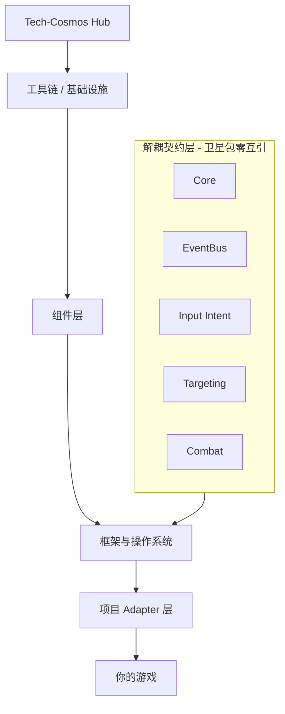

# Tech-Cosmos

A technological cosmos for industrializing game content creation. 游戏内容工业化生产的技术宇宙。

# 🪐 技术宇宙 (The Technological Cosmos)

**这里不是项目的集合，而是体系的呈现。**

我通过构建系统来构建游戏。本仓库是这一思想的**指挥中心**：承载哲学与架构文档，并内置 **[Tech-Cosmos Hub](./Tech-Cosmos.Hub/)** —— Unity 编辑器内的集成入口，用于浏览全部卫星仓库、按需导入 UPM、生成胶水代码与项目脚手架。

> "我们无法突破维度的边界，但可以在已知的疆土上，建造最辉煌的城池。"

## 🚀 即刻探索

*   **🧭 集成中枢 (Hub)** → [Tech-Cosmos.Hub](./Tech-Cosmos.Hub/README.md) · Unity 菜单 `Tech-Cosmos → Hub`
*   **🎯 我们的哲学** → [构建者宣言](./MANIFESTO.md)
*   **🏛️ 我们的架构** → [总架构图](./ARCHITECTURE.md)
*   **🌌 我们的模块** → [技术星图](./GALAXY.md)，直达每一个核心仓库
*   **📖 新手引导** → [快速启动](./GETTING-STARTED.md)
*   **🔭 未来规划** → [发展路线图](./ROADMAP.md)
*   **📅 演进历程** → [时间线](./TIMELINE.md)

## 💡 核心洞察

真正的创造，源于对底层规则的深刻理解与运用。这里的每一个工具、每一个组件，都不是为了解决单一问题，而是为了**消灭某一类问题的存在**。

**零耦合拼装**：各 Framework 包互不引用；跨包协作只在项目 `Adapter` 层完成。Hub 负责浏览与安装，不负责把代码揉在一起。

## 🧭 Tech-Cosmos Hub（本仓库内置）

| 能力 | 说明 |
|------|------|
| 技术框架 | 浏览 25+ 包、README 预览、**Git URL / 本地** 导入 manifest |
| 胶水生成 | 条件满足时生成 `Assets/_Game/Generated/Hub/*.g.cs` |
| 项目结构 | 一键生成 `_Game` 目录脚手架（精简 / 标准 / 完整） |

**安装（UPM Git URL）：**

```
https://github.com/PeterParkers007/Tech-Cosmos.git?path=/Tech-Cosmos.Hub
```

## 🏗️ 架构全景


```mermaid
graph TB
    H[Tech-Cosmos Hub] --> A[工具链 / 基础设施]
    A --> B[组件层]
    B --> C[框架与操作系统]
    C --> D[项目 Adapter 层]
    D --> E[你的游戏]

    subgraph F [解耦契约层 - 卫星包零互引]
        F1[Core]
        F2[EventBus]
        F3[Input Intent]
        F4[Targeting]
        F5[Combat]
    end

    F --> C
```

## 📚 快速一览

| 层级 | 代表模块 | 核心价值 |
| :--- | :--- | :--- |
| **Hub** | `Tech-Cosmos.Hub` | 浏览、安装、胶水、脚手架 — 唯一集成入口 |
| **解耦契约** | `Core`, `EventBus`, `Input`, `Targeting`, `Combat` | 引擎无关原语，包间零引用 |
| **工具链** | `PoolSystem`, `SerializationKit`, `MSE` | 原子能力，消除重复劳动 |
| **组件层** | `Unit-Core`, `CommandSystem`, `UniversalSelection` | 封装业务逻辑，高度复用 |
| **框架/OS** | `SkillSystem`, `ECS`, `AI-OS`, `Input-OS` | 领域能力内核 |
| **集成** | 项目 `_Game/Adapters/` | 唯一「认识多方」的胶水层 |

## 🛠️ 技术栈

- **引擎**: Unity 2022.3 LTS+
- **语言**: C#
- **分发**: Unity Package Manager（Git URL / 本地嵌入）
- **架构**: 分层 + 模块化 + 零耦合 + Adapter 集成
- **理念**: 配置优于编码，系统优于功能

---

*最后更新：2026年6月*
