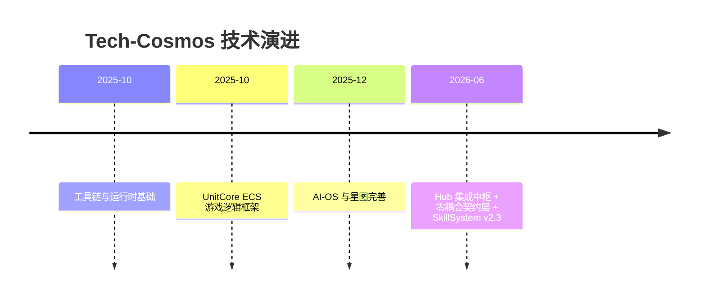

# Tech-Cosmos 工具发展时间线

记录技术宇宙中各模块的诞生与重要演进节点。

---

## 📅 2026年

### 6月 — 集成中枢与零耦合生态
- **Tech-Cosmos Hub v1.1** — 并入 [Tech-Cosmos](https://github.com/PeterParkers007/Tech-Cosmos) 主仓库
  - UI Toolkit 自适应 Hub 窗口
  - Git URL / 本地双模式 UPM 导入
  - 条件化胶水生成 + 项目结构脚手架（精简/标准/完整）
- **解耦契约层** — Core、EventBus、Input(Intent)、Targeting、Combat
  - 卫星包零 asmdef 互引，Adapter 集成范式落地
- **SkillSystem v2.3** — GBF Buff 并入；Graph 编辑器；独立 BuffSystem 仓库归档

---

## 📅 2025年

### 12月 — 星图与 AI-OS
- 更新技术星图，录入 AI-OS 等模块

### 10月 — 基础设施与框架爆发

#### 第四周 (10/24–10/28)
- **Tech-Cosmos.Framework.ECS** — ECS 架构框架
- **Tech-Cosmos.Infra.LoggingSystem** — 智能日志
- **Tech-Cosmos.Pipeline.AssetBundleBuilder** — AB 构建器
- **Tech-Cosmos.Component.UnitCore** — 单位核心系统

#### 第三周 (10/21)
- **Tech-Cosmos.Runtime.PoolSystem** — 对象池

#### 第二周 (10/18–10/19)
- **Tech-Cosmos.Runtime.UpdateManager** — 全局 Update 调度
- **Tech-Cosmos.Runtime.ToolBox** — 通用工具库
- **Tech-Cosmos.Infra.Serialization** — 配置序列化

#### 第一周 (10/3)
- **Tech-Cosmos.Runtime.Animation** — UI 动画系统

---

## 📊 架构演进


```mermaid
timeline
    title Tech-Cosmos 技术演进
    2025-10 : 工具链与运行时基础
    2025-10 : UnitCore ECS 游戏逻辑框架
    2025-12 : AI-OS 与星图完善
    2026-06 : Hub 集成中枢 + 零耦合契约层 + SkillSystem v2.3
```

### 演进路径
```
原子工具 → 组件/OS 框架 → 零耦合契约 → Hub 统一集成 → Adapter 拼装游戏
```

---

## 🏆 里程碑摘要

| 时期 | 里程碑 | 意义 |
|------|--------|------|
| 2025 Q4 | 20+ UPM 卫星包 | 工具链与框架矩阵成型 |
| 2026 Q2 | Hub + 契约层 | 从「仓库集合」升级为「可拼装生态」 |
| 2026 Q2 | SkillSystem 合并 Buff | 技能/Buff 统一工业化管线 |

---

*文档反映 Tech-Cosmos 从单点工具到集成生态的完整成长历程。*
