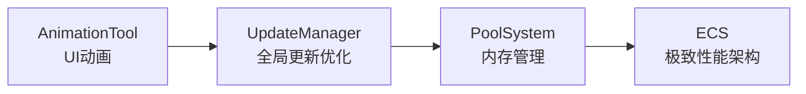
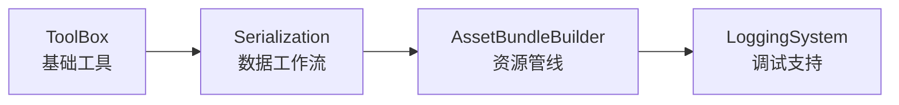
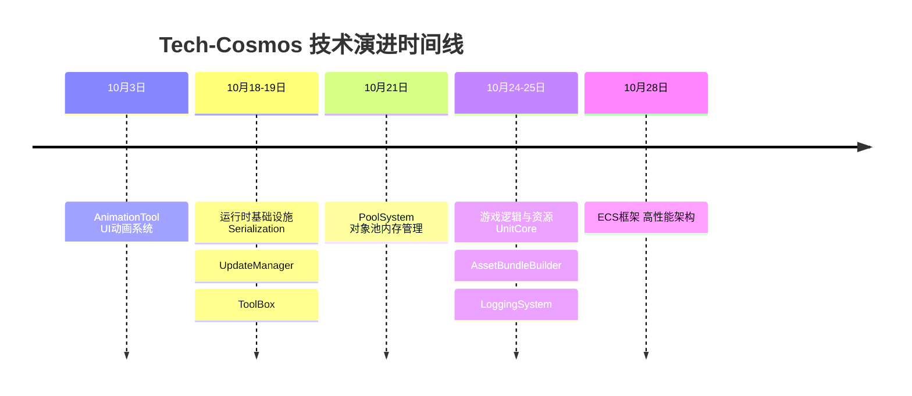

# Tech-Cosmos 工具发展时间线

记录 Tech-Cosmos 框架中各个工具模块的诞生和发展历程。

## 📅 时间线概览

### 2025年10月

#### 🟢 第四周 (10月24日-10月28日)
- **Tech-Cosmos.Framework.ECS** - `2025-10-28 12:18:38`
  - 🎯 **ECS架构框架** - 高性能实体组件系统
  - 核心价值：稀疏集存储、事件系统、组件同步机制
  - 特性：O(1)组件访问、内存紧凑、类型安全

- **Tech-Cosmos.Infra.LoggingSystem** - `2025-10-25 15:52:44`
  - 📝 **智能日志系统** - 多目标日志管理
  - 核心价值：统一日志接口，支持控制台/文件/网络/数据库输出
  - 特性：级别过滤、分类管理、堆栈跟踪、性能监控

- **Tech-Cosmos.Pipeline.AssetBundleBuilder** - `2025-10-25 13:21:03`
  - 📦 **AssetBundle智能构建器** - 可视化资源打包工具
  - 核心价值：自动化Bundle命名、资源依赖分析
  - 特性：命名规则配置、资源过滤、构建预览、版本管理

- **Tech-Cosmos.Component.UnitCore** - `2025-10-24 19:12:21`
  - 👥 **单位核心系统** - 模块化游戏单位框架
  - 核心价值：能力工厂模式、事件驱动架构
  - 特性：动态能力注册、属性管理、战斗系统

#### 🟡 第三周 (10月21日)
- **Tech-Cosmos.Runtime.PoolSystem** - `2025-10-21 19:13:15`
  - 🎯 **高性能对象池系统** - 内存管理优化
  - 核心价值：基于Unity ObjectPool的泛型池实现
  - 特性：自动扩容、生命周期管理、性能监控

#### 🟡 第二周 (10月18日-10月19日)
- **Tech-Cosmos.Runtime.Update** - `2025-10-19 14:29:34`
  - 🔄 **UpdateManager - 全局更新调度器**
  - **核心价值**：高性能全局更新调度，支持动态注册与线程安全
  - **技术亮点**：
    - 双缓冲列表避免迭代时修改异常
    - 集中管理所有 IObserverUpdate/FixedUpdate 对象
    - 大幅减少 Unity 生命周期方法开销
  - 适用场景：大量动态对象的统一逻辑刷新（移动、状态更新等）

- **Tech-Cosmos.Runtime.ToolBox** - `2025-10-19 13:34:01`
  - 🧰 **通用工具库** - 开发效率提升工具集
  - 核心价值：常用功能封装，避免重复造轮子
  - 特性：鼠标位置工具、单例模式、组件安全获取

- **Tech-Cosmos.Infra.Serialization** - `2025-10-18 08:32:55`
  - 💾 **配置数据序列化系统** - 游戏数据导出框架
  - 核心价值：ScriptableObject到JSON的自动化导出
  - 特性：类型安全、批量处理、自定义过滤

#### 🔵 第一周 (10月3日)
- **Tech-Cosmos.Runtime.Animation** - `2025-10-03 11:24:29`
  - ✨ **AnimationTool - 一站式UI动画系统**
  - **核心价值**：UI动效 + 事件 + 音效一体化解决方案
  - **技术亮点**：
    - 支持位置、颜色、缩放、旋转四种动画类型
    - 兼容 Image、Text、TextMeshPro 等UI组件
    - 基于鼠标事件自动触发，可配置音效与动画曲线
    - 通过 AnimationManager 统一管理协程，避免重复播放与资源泄漏
  - 适用场景：按钮交互、页面过渡、动态效果等所有UI动画需求

## 📊 架构演进分析

### 🎨 用户体验层 (10月3日)
**AnimationTool** - 为游戏提供精美的视觉反馈和交互体验

### ⚙️ 运行时基础设施 (10月18日-10月19日)
**Serialization + UpdateManager + ToolBox** - 构建稳定的运行时环境

### 🗃️ 资源与数据管理 (10月21日-10月25日)
**PoolSystem + AssetBundleBuilder + LoggingSystem** - 完善的资源管线

### 🎮 游戏逻辑框架 (10月24日-10月28日)  
**UnitCore + ECS** - 强大的游戏逻辑架构

## 🚀 技术演进

### 性能优化路径

### 开发体验提升

## 🏆 核心价值总结

| 工具 | 核心价值 | 技术亮点 |
|------|----------|----------|
| **AnimationTool** | UI动效一体化解决方案 | 四种动画类型、事件驱动、协程管理 |
| **UpdateManager** | 高性能全局更新调度器 | 双缓冲列表、线程安全、减少Update开销 |
| **PoolSystem** | 内存管理优化 | 泛型对象池、自动扩容 |
| **UnitCore** | 模块化单位框架 | 能力工厂、事件驱动 |
| **ECS** | 极致性能架构 | 稀疏集、内存紧凑、O(1)访问 |

## 🔮 未来展望

基于当前坚实的技术基础，可向以下方向发展：
- **网络同步框架** - 基于ECS的预测回滚网络
- **可视化编辑器** - 为各系统提供可视化配置工具
- **性能分析套件** - 深度集成性能监控和优化建议

---

*文档反映了 Tech-Cosmos 从具体功能到系统架构的完整技术成长历程*